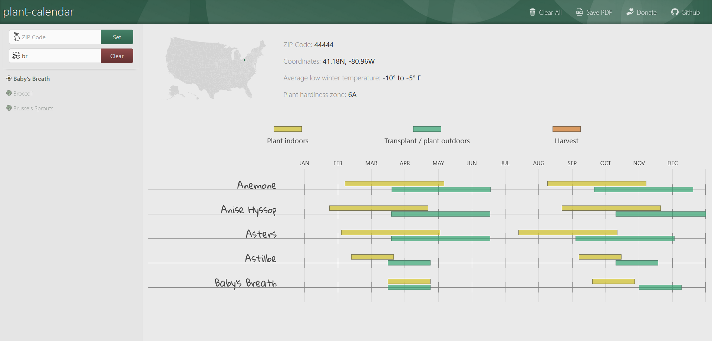

[Demo](https://gg314.github.io/plant-calendar)

# plant-calendar
A seed planting calendar based on ~~USDA's Plant Hardiness Zones~~ average frost dates, written in Elm.

## How does it work?
Enter your ZIP code to find the pre-computed closest NOAA GHCND weather station(s). The NOAA API returns average
frost dates (28° F, 10% probability to exceed) for the weather station. Recommended planting dates are then
computed based on the spring frost date.

Of course, successful planting actually requires close attention to many more variables including soil temperature,
moisture, seed variety, etc.

## Outdated, approximate preview


## Build
Compile javascript from root directory: ```elm make ./src/PlantCalendar.elm --output=./assets/js/main.js```

Start project server at `http://localhost:8000` with ```elm reactor```. Navigate to `http://localhost:8000/index.html` to see the project.

## Roadmap
* It would be nice to add more species, including fruits and flowers, if reliable recommendation data can be found.
* Harvest dates and late-season cycles could also be added.
* In areas where no frost is expected, the calendar needs to be adjusted and clarified.
* Latitude/longitude coordinates could be displayed on the PDF rather than highlighted ZIP regions.
